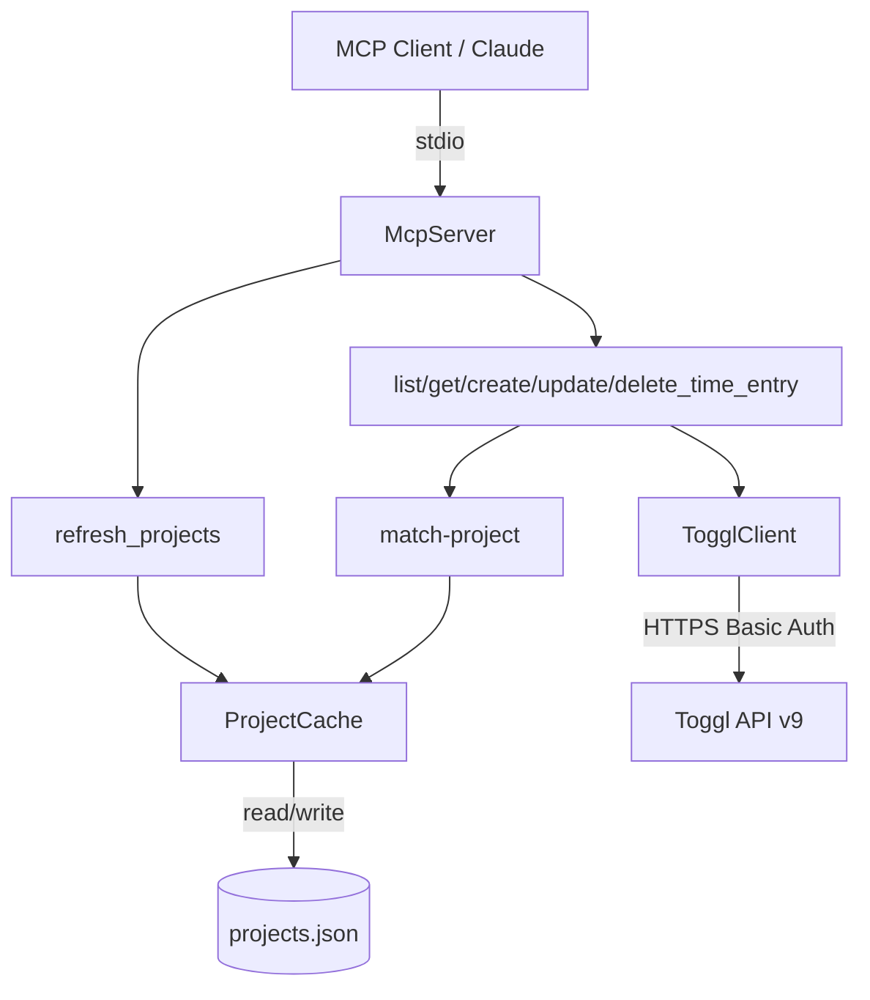

# Time Entries MCP Design

**Spec**: `.specs/features/TOGGL-2-time-entries-mcp/spec.md` (TEM-01..TEM-24)
**Status**: Draft

> **Revision (2026-08-26):** Scope was cut back to read-only listing — see spec.md's own
> Revision section. Everything below describing `create`/`update`/`delete`/`get_time_entry`,
> `refresh_projects`, or ticket-code project matching is historical: that code was removed. The
> surviving design is the Toggl fetch client (`listTimeEntries`/`listProjects` only), the project
> cache, and `list_time_entries` — read the rest of this document with that filter applied.

---

## Architecture Overview

One flat TypeScript package, `mcp/`, sibling to `to-jira/` (no npm workspaces, per Out of Scope). A single stdio MCP server process registers 6 tools. Every tool handler is a thin orchestration over three collaborators: a hand-written Toggl fetch client, a local JSON project cache, and a pure matching function. No framework, no DI container — one `index.ts` builds the collaborators once and closes over them when registering tools.



Conforms to AD-001's statelessness principle (no DB, no networked store) even though the feature sits outside AD-001's literal domain (Toggl↔JIRA sync) — the local project-cache file is the one deliberate exception, exactly as AD-001 already accepts for its own domain. Conforms to AD-003 by *not* wiring OpenTelemetry (Out of Scope table: AD-003 scopes OTel to long-lived services; this is a short-lived stdio child process).

---

## Code Reuse Analysis

### Existing Patterns to Leverage

| Pattern | Source | How it's reused |
| --- | --- | --- |
| Ticket-code regex | `to-jira/internal/toggl/parse.go` (`^\[([A-Z][A-Z0-9]{1,9})-(\d+)\]\s*(.*)$`) | Same pattern, re-expressed as a TS `RegExp` literal in `src/matching/match-project.ts` — no cross-language import possible, but the exact source is comment-referenced (TEM-13). |
| `.env` + fail-loud config validation | `to-jira/internal/shared/config` (`godotenv.Load()`, required-field checks, joined errors) | Same shape in `src/config.ts`: load `.env` via `dotenv`, validate all required vars, join every missing/invalid one into a single startup error (TEM-01) instead of failing on the first. |
| No live network calls in tests | `to-jira`'s hard project constraint (`docs/codebase/TESTING.md`) | Carried over verbatim: all `mcp/` tests run a local `node:http` fake Toggl server, never the real API. |
| Structured, typed errors over string matching | `jira.TransientError`/`PermanentError` in `to-jira/internal/jira` | Same idea, TS shape: `TogglApiError`/`TogglNetworkError` classes callers branch on by `type`, not by parsing messages. |
| `.env.sample` committed, `.env` gitignored | `to-jira/.env.sample` | `mcp/.env.sample` follows the same required/optional comment-block convention (TEM-01 AC4). |

No code is directly importable (different language, different repo module) — reuse here is convention-level, not dependency-level.

### Integration Points

| System | Integration Method |
| --- | --- |
| Toggl API v9 (`https://api.track.toggl.com/api/v9`) | `TogglClient` — hand-written `fetch` wrapper, HTTP Basic Auth (token as username, literal `api_token` as password), types generated once via `openapi-typescript` from a `swagger2openapi`-converted spec. |
| Local filesystem | `ProjectCache` reads/writes one JSON file at `TOGGL_CACHE_PATH` (default `~/.cache/toggl-mcp/projects.json`). No other persistence. |

---

## Components

### `src/index.ts` — bootstrap

- **Purpose**: Load config, construct collaborators, register the 6 tools, connect the stdio transport.
- **Interfaces**: none exported — the process entrypoint.
- **Dependencies**: `config.ts`, `toggl/client.ts`, `cache/project-cache.ts`, all of `tools/*`.
- **Reuses**: n/a (bootstrap is new).
- **Behavior**: on a config error, log every missing/invalid var to stderr and `process.exit(1)` before any tool is registered (TEM-01 AC1) — the MCP handshake never starts on bad config.

### `src/config.ts`

- **Purpose**: Load and validate `TOGGL_API_TOKEN`, `TOGGL_WORKSPACE_ID`, `TOGGL_CACHE_PATH` from the environment (`.env` via `dotenv`).
- **Interfaces**:
  - `loadConfig(env: NodeJS.ProcessEnv): Config` — throws `ConfigError` (all missing/invalid vars joined into one message) rather than returning per-field results, mirroring `to-jira`'s `errors.Join` pattern.
- **Dependencies**: `dotenv` (dev-equivalent of `godotenv`).

### `src/logger.ts`

- **Purpose**: The whole observability story (TEM-24 AC4) — every log/diagnostic line goes to `console.error` (stderr), never `console.log`/stdout, which is reserved for MCP protocol frames.
- **Interfaces**: `log(level: "info" | "warn" | "error", message: string, meta?: Record<string, unknown>): void` — meta is JSON-stringified; the token is never a legal key (TEM-01 AC3 enforced by never passing `config` wholesale into `meta`).

### `src/toggl/generated.ts`

- **Purpose**: `openapi-typescript`-generated request/response types. Committed, never hand-edited (regenerated via `npm run generate:openapi`, see Tech Decisions).
- **Reuses**: Toggl's own Swagger 2.0 spec, converted once to 3.x and committed alongside at `mcp/openapi/`.

### `src/toggl/client.ts`

- **Purpose**: One thin `fetch` wrapper for every Toggl call the server makes — no retry, no backoff, no proactive throttling (TEM-24 AC1, Q7).
- **Interfaces**:
  - `class TogglClient { constructor(opts: { apiToken: string; baseUrl?: string }) }`
  - `listTimeEntries(query: { start_date: string; end_date: string }): Promise<RawTimeEntry[]>` — `GET /me/time_entries`
  - `getTimeEntry(id: number): Promise<RawTimeEntry>` — `GET /me/time_entries/{id}`
  - `createTimeEntry(workspaceId: number, body: CreateTimeEntryBody): Promise<RawTimeEntry>` — `POST /workspaces/{wid}/time_entries`
  - `updateTimeEntry(workspaceId: number, id: number, body: RawTimeEntry): Promise<RawTimeEntry>` — `PUT /workspaces/{wid}/time_entries/{id}`
  - `deleteTimeEntry(workspaceId: number, id: number): Promise<void>` — `DELETE /workspaces/{wid}/time_entries/{id}`
  - `listProjects(): Promise<RawProject[]>` — `GET /me/projects?include_archived=false` (endpoint per spec.md TEM-08 AC1; see Risks & Concerns for the `/me/*` vs `/workspaces/{wid}/*` note)
- **Error mapping**: any non-2xx throws `TogglApiError { status, method, path, body, retryAfter? }` (from `Retry-After` header when present); a `fetch` rejection (network/timeout) throws `TogglNetworkError { operation, cause }`. Neither is caught here — tool handlers catch and shape them into the tool result (TEM-24 AC1–AC3).
- **Auth**: every request sets `Authorization: Basic base64(apiToken + ":api_token")` (TEM-02 AC2); the header value is never logged.

### `src/cache/project-cache.ts`

- **Purpose**: TTL-bounded local JSON cache of Toggl projects, the only persisted state in the whole server.
- **Interfaces**:
  - `getProjects(client: TogglClient, cachePath: string, opts?: { forceRefresh?: boolean }): Promise<{ projects: CachedProject[]; warning?: StaleCacheWarning }>`
- **Dependencies**: `node:fs/promises`, `TogglClient`.
- **Behavior**: full read/write/TTL/atomicity strategy in [Cache Strategy](#cache-strategy) below.

### `src/matching/match-project.ts`

- **Purpose**: Pure functions — ticket-code extraction and project resolution. No I/O; callers pass in the already-loaded project list.
- **Interfaces**:
  - `extractTicketCode(description: string): string | null`
  - `resolveProject(code: string, projects: CachedProject[]): MatchResult`
- **Dependencies**: none (pure).
- **Reuses**: `to-jira`'s regex convention (TEM-13).
- Exact algorithm in [Matching Algorithm](#matching-algorithm) below.

### `src/time-entries/curate.ts`

- **Purpose**: Map a raw Toggl time entry + the loaded project list into the 5-field curated shape (TEM-05).
- **Interfaces**: `toCuratedEntry(entry: RawTimeEntry, projectsById: Map<number, string>): CuratedTimeEntry`
- **Behavior**: `project` is `null` when `entry.project_id` is `null`/absent; otherwise it's `projectsById.get(entry.project_id) ?? null` (see Risks & Concerns — the raw entry's own field for the project's name was not verified).

### `src/tools/*.ts` (6 files, one per tool) + `src/tools/schemas.ts`

- **Purpose**: One file per MCP tool — zod input schema, orchestration, structured result/error shaping. `schemas.ts` holds shared validators (`rfc3339Timestamp`, `dateOrTimestamp`, `positiveId`).
- **Interfaces**: each file exports `register<ToolName>(server: McpServer, deps: { client: TogglClient; cachePath: string; config: Config }): void`, called once from `index.ts`.
- **Dependencies**: `@modelcontextprotocol/sdk` (`server.registerTool`), `zod`, the collaborators above.
- **Reuses**: `curate.ts`, `match-project.ts`, `project-cache.ts`, `errors.ts` (below).

### `src/errors.ts`

- **Purpose**: One function turning any caught error (`TogglApiError`, `TogglNetworkError`, a `MatchResult` of kind `"ambiguous"`/`"no_match"`) into the tool result shape in [Error Handling Strategy](#error-handling-strategy).
- **Interfaces**: `toErrorResult(err: TogglApiError | TogglNetworkError | MatchingError): CallToolResult` (`{ content: [{ type: "text", text }], isError: true }`).

---

## Data Models

```typescript
interface Config {
  togglApiToken: string;
  togglWorkspaceId: number;
  cachePath: string; // default: ~/.cache/toggl-mcp/projects.json
}

interface CuratedTimeEntry {
  id: number;
  description: string;
  start: string;       // RFC3339
  stop: string | null;  // null only possible on reads of pre-existing running entries — this server never creates one (no running-timer support)
  project: string | null;
}

interface CachedProject {
  id: number;
  name: string;
  active: boolean;
  workspaceId: number;
}

interface ProjectCacheFile {
  fetchedAt: string;        // ISO 8601
  projects: CachedProject[]; // full /me/projects?include_archived=false result, unfiltered
}

type MatchResult =
  | { status: "matched"; project: CachedProject }
  | { status: "no_match"; extractedCode: string; candidates: { id: number; name: string }[] }
  | { status: "ambiguous"; extractedCode: string; candidates: { id: number; name: string }[] };

interface StaleCacheWarning {
  type: "stale_cache";
  cacheAgeSeconds: number;
  underlyingError: string;
}
```

**Relationships**: `ProjectCacheFile.projects` feeds both `match-project.ts` (filtered to `active && workspaceId === target`) and `curate.ts` (unfiltered — see Risks & Concerns, project ids are globally unique so an unfiltered id→name lookup is safe and strictly more complete).

---

## Matching Algorithm

Exact logic for TEM-13/TEM-14/TEM-15/TEM-16/TEM-17:

```typescript
const TICKET_CODE_PATTERN = /^\[([A-Z][A-Z0-9]{1,9})-(\d+)\]\s*(.*)$/;
const BRACKET_PREFIX = /^\[[^\]]*\]\s*(.*)$/;

function extractTicketCode(description: string): string | null {
  const m = TICKET_CODE_PATTERN.exec(description);
  return m ? m[1] : null;
}

function stripBracketPrefix(name: string): string {
  const m = BRACKET_PREFIX.exec(name);
  return m ? m[1] : name; // no bracket ⇒ compare the whole name
}

function resolveProject(code: string, allProjects: CachedProject[], workspaceId: number): MatchResult {
  const candidates = allProjects.filter(p => p.active && p.workspaceId === workspaceId);
  const matches = candidates.filter(
    p => stripBracketPrefix(p.name).toLowerCase() === code.toLowerCase()
  );
  if (matches.length === 1) return { status: "matched", project: matches[0] };
  if (matches.length === 0) {
    return { status: "no_match", extractedCode: code, candidates: candidates.map(p => ({ id: p.id, name: p.name })) };
  }
  return { status: "ambiguous", extractedCode: code, candidates: matches.map(p => ({ id: p.id, name: p.name })) };
}
```

Orchestration in `create_time_entry`/`update_time_entry` (TEM-16, TEM-22):

1. If `project_id` is supplied explicitly → use it verbatim, skip extraction/matching entirely, **never call `getProjects`** (TEM-16).
2. Else, extract the code. If `extractTicketCode` returns `null` → proceed with `project_id: undefined`, result reports `project: null` (TEM-17).
3. Else, call `getProjects()` (may hit the cache or Toggl) and run `resolveProject`. `"matched"` → use `project.id`. `"no_match"`/`"ambiguous"` → return the matching error immediately; the caller (tool handler) must not issue the `POST`/`PUT` (TEM-15, TEM-19 AC6).

`update_time_entry` only re-runs this when `description` is among the supplied fields (TEM-22); otherwise the merged entry's existing `project_id` passes through untouched and `getProjects` is never called (TEM-21 AC4... i.e. TEM-04 row "Description not supplied" — spec's own P1 Update AC4).

---

## Cache Strategy

`getProjects(client, cachePath, { forceRefresh })`:

1. **Read**: `fs.readFile(cachePath)` → `JSON.parse`. Any failure (ENOENT, parse error, missing `fetchedAt`/`projects`) is caught and treated as `cached = null` — never thrown (TEM-10).
2. **Freshness check**: `stale = cached === null || Date.now() - Date.parse(cached.fetchedAt) >= 7 * 24 * 60 * 60 * 1000` (TEM-09 AC2/AC3). `forceRefresh` (set only by `refresh_projects`, TEM-09 AC4) forces the refetch branch regardless.
3. **Fresh cache, no force** → return `cached.projects` immediately. Zero Toggl calls (TEM-09 AC2).
4. **Refetch needed** (`stale || forceRefresh`) → call `client.listProjects()`.
   - **Success** → write atomically: serialize `{ fetchedAt: new Date().toISOString(), projects }`, write to `${cachePath}.tmp-${process.pid}` in the same directory, `fs.rename()` over `cachePath` (atomic on the same filesystem — Edge Cases: a torn read from a concurrent process degrades to step 1's cache-miss path, never a crash). If the write itself fails (permissions, read-only fs) → `logger.log("error", ...)` and still return the freshly-fetched list from memory; the tool call completes successfully (TEM-11).
   - **Failure** (network, `429`, 5xx) and `cached !== null` → return `{ projects: cached.projects, warning: { type: "stale_cache", cacheAgeSeconds, underlyingError } }` (TEM-12 AC7).
   - **Failure** and `cached === null` → rethrow the underlying `TogglApiError`/`TogglNetworkError` (TEM-12 AC8) — the tool handler surfaces it via `toErrorResult`.

`refresh_projects` tool: call with `forceRefresh: true`; on success, return `{ count: projects.length, fetchedAt }`; on failure it follows the same stale/hard-error branches as any other caller (no special case — spec does not carve one out).

---

## Error Handling Strategy

| Error Scenario | Handling | Tool result shape |
| --- | --- | --- |
| Input fails the zod `inputSchema` (wrong type, bad enum, `.refine` failure e.g. `end_date < start_date`) | SDK validates before the handler runs (confirmed via `@modelcontextprotocol/sdk` v1.x docs — `registerTool`'s `inputSchema` is a `ZodRawShape`) | `{ content: [...], isError: true }`, generated by the SDK itself — **zero Toggl requests**, satisfying TEM-04/TEM-24 AC5 for free. |
| Toggl non-2xx (incl. `404` on get/delete, `429`) | `TogglClient` throws `TogglApiError`; tool handler catches, `toErrorResult` maps to `{ error: { type: "toggl_api", status, method, path, body, retryAfter?, notFound? } }` | `isError: true`; `retryAfter` populated only when Toggl sent `Retry-After` (TEM-24 AC1); `notFound: true` when `status === 404` (TEM-07 AC7, TEM-23 AC2). |
| Toggl network failure / timeout | `TogglClient` throws `TogglNetworkError`; mapped to `{ error: { type: "network", message, operation } }` | `isError: true` (TEM-24 AC3) — never an empty success. |
| Ticket-code matches 0 or >1 active project | `resolveProject` returns `"no_match"`/`"ambiguous"`; tool handler returns before any write | `{ error: { type: "matching", extractedCode, candidates } }`, `isError: true` (TEM-15). |
| Cache file corrupt/unreadable | Degrades silently to a cache miss inside `getProjects` | Not surfaced as an error at all — the call proceeds as if no cache existed (TEM-10). |
| Cache file unwritable | Logged to stderr only | Tool call still succeeds (TEM-11). |
| Stale cache + Toggl unreachable, cache available | `getProjects` returns the stale list + `warning` | Success result gains a `warnings: [StaleCacheWarning]` field; the tool still completes (TEM-12). |
| Untagged description, no `project_id` | `extractTicketCode` returns `null` | Success; `project: null` in the result (TEM-17). |

All success payloads are the curated JSON (`CuratedTimeEntry` or the `refresh_projects` summary), serialized into a single `{ type: "text", text: JSON.stringify(payload) }` content block — no `outputSchema`/`structuredContent` is declared, keeping the shape stable regardless of client-side structured-output support (see Tech Decisions).

---

## Risks & Concerns

| Concern | Location | Impact | Mitigation |
| --- | --- | --- | --- |
| `RawTimeEntry`'s own project-name field was not verified — grilling's Swagger research checked the Projects schema, not the TimeEntry schema, and spec.md TEM-05 AC3 assumes a `project_name`-equivalent exists on reads. | `src/time-entries/curate.ts` | If Toggl's raw entry has no name field, curating from it directly would be impossible without an extra call per read (violating TEM-03's "one call" rule). | Design resolves names via the already-mandatory Projects cache (`projectsById` map), which costs zero incremental calls in the common case and is correct whether or not a raw field also exists. If Execute finds a raw field, prefer it and use the cache lookup only as a fallback — flagged for Execute to confirm against a real response, per the phase's own instruction not to verify library/API shape by executing code in Design. |
| Projects endpoint used by spec.md TEM-08 (`/me/projects`) differs from the endpoint grilling's background research examined (`/workspaces/{wid}/projects`); `/me/projects` is not itself scoped to one workspace. | `src/toggl/client.ts:listProjects`, `src/cache/project-cache.ts` | Without workspace filtering, matching could resolve a `project_id` that belongs to a different workspace than the one the entry is being written to — Toggl would likely reject or misattach the write. | `CachedProject.workspaceId` is stored from the raw response and `resolveProject` filters candidates to `workspaceId === target` before matching (see Matching Algorithm), mirroring TEM-06's already-established client-side workspace filter for time-entry reads. This extends spec.md's own pattern rather than contradicting it. |
| `update_time_entry`/`delete_time_entry` always target `/workspaces/{TOGGL_WORKSPACE_ID}/...` — no per-call `workspace_id` override, unlike `create_time_entry` (TEM-20). | `src/tools/update-time-entry.ts`, `src/tools/delete-time-entry.ts` | An entry created with an overridden `workspace_id` cannot later be updated/deleted through this server (Toggl would 404 it against the default workspace). | Not fixed — spec.md only requires the override on create (TEM-20); expanding it to update/delete would be scope the spec never asked for. Documented here rather than silently either adding or dropping the capability. |
| Read-modify-write update (TEM-21 AC2: `GET` then `PUT`) has no optimistic-concurrency guard (no `If-Match`/`at`-timestamp check documented in Toggl's spec). | `src/tools/update-time-entry.ts` | A concurrent edit via the Toggl web UI between the `GET` and `PUT` could be silently clobbered. | Accepted — this is a single local operator (stdio, Out of Scope row on HTTP/SSE), and Toggl's spec doesn't document a conditional-write mechanism to build against. No code change; documented trade-off, same style as AD-001's own accepted trade-off. |
| 30 req/hour ceiling with zero proactive throttling (Q7) | Whole server | A busy session (e.g. several updates, each 2 calls, plus a project-cache refetch) can hit `429` well before an hour of wall-clock time. | By design (TEM-24 AC1) — Toggl's `429` (with `Retry-After`) is surfaced verbatim; the agent decides whether to wait. No mitigation needed beyond what's already specified. |

> No fragile pre-existing code, tech debt, or test-coverage gap was found — this is a new package with no existing implementation to inherit risk from.

---

## Tech Decisions

| Decision | Choice | Rationale |
| --- | --- | --- |
| MCP SDK API surface | `@modelcontextprotocol/sdk` v1.x: `McpServer` from `.../server/mcp.js`, `StdioServerTransport` from `.../server/stdio.js`, `server.registerTool(name, { description, inputSchema: ZodRawShape }, cb)`, `server.connect(transport)` | Confirmed against the SDK's own v1.29.0 docs via Context7 (not executed/smoke-tested, per this phase's constraint) — matches the task's stated dependency and is the current stable major (a v2 alpha exists with different import paths/package name (`@modelcontextprotocol/server`); not used here since the task names `@modelcontextprotocol/sdk`). |
| Tool result content | Plain `{ content: [{ type: "text", text: JSON.stringify(payload) }], isError? }` — no `outputSchema`/`structuredContent` | Keeps every tool's contract to one code path regardless of client-side structured-output support; matches the SDK's own documented error-result shape. |
| Module system | ESM (`"type": "module"`), TypeScript `strict: true`, `NodeNext` module resolution | No existing TS precedent in the repo to follow; ESM + strict is the current idiomatic default for a new Node 18+ CLI/server package. |
| HTTP client | Node's built-in `fetch` — no `axios`/`node-fetch` dependency | Confirmed available and stable since Node 18; matches the grilling decision for a hand-written thin client with minimal dependencies. |
| Test runner | Node's built-in `node:test` + `node:assert/strict` — no Jest/Vitest | Mirrors `to-jira`'s stdlib-only testing philosophy (`docs/codebase/TESTING.md`); the package has no need for a heavier framework at this scope. All Toggl calls are faked via `node:http`, matching `to-jira`'s hard "no live network calls in tests" constraint. |
| API types | `openapi-typescript` output committed at `src/toggl/generated.ts`, generated from a `swagger2openapi`-converted spec committed at `mcp/openapi/toggl.openapi3.json`, alongside the raw Swagger 2.0 source at `mcp/openapi/toggl.swagger2.json` | Per grilling Q15 — types-only codegen, both spec artifacts committed for reproducible offline builds and reviewable diffs on Toggl schema changes. Regenerated manually via `npm run generate:openapi` (no CI, per Out of Scope). |
| File/dir naming inside `mcp/` | kebab-case filenames (`match-project.ts`, `project-cache.ts`), lowercase single-purpose directories (`toggl/`, `cache/`, `matching/`, `tools/`) | No existing TS precedent to follow; kebab-case is the idiomatic Node/TS convention, deliberately distinct from `to-jira`'s Go `snake_case` (a Go-specific convention, not meant to be copied cross-language). |
| Dependency injection | None — `index.ts` constructs `TogglClient` and reads `Config` once, then each `register<Tool>` function receives them directly as plain arguments | The whole collaborator graph is 2 objects; a `to-jira`-style `internal/shared/di` package would be unjustified machinery at this scope (Simplicity First). |
| Cache write atomicity | Temp file in the same directory (`${cachePath}.tmp-${pid}`) + `fs.rename()` | `fs.rename` is atomic within one filesystem; avoids ever exposing a partially-written cache file to a concurrent reader (Edge Cases row). |

> **Project-level decision recorded**: Appended `AD-004` to `.specs/STATE.md` — see below. This is the repo's first TypeScript package, and the tooling/testing conventions above (ESM+strict, `node:test`, hand-written `fetch` clients over generated runtime clients, kebab-case files) are intended as the default for future TS packages in this monorepo, not just this feature.

---

## Tips / Open Questions Carried Into Execute

- Confirm on a real Toggl response whether `RawTimeEntry` carries a project-name field directly; if so, prefer it over the cache lookup in `curate.ts` (see Risks & Concerns row 1).
- Confirm `/me/projects` (not `/workspaces/{wid}/projects`) is in fact the correct endpoint per spec.md TEM-08 AC1 when Execute first calls it against a fake server built from the committed OpenAPI 3.x spec.
