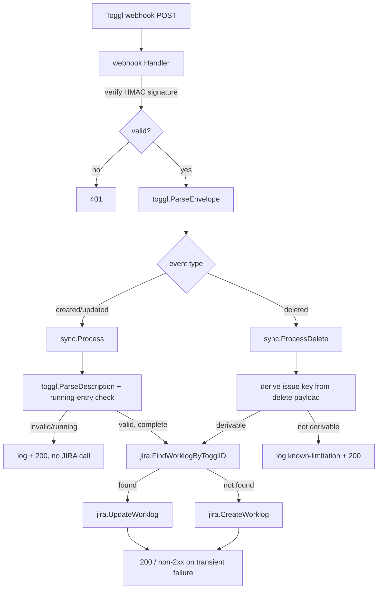

# to-jira Design

**Spec**: `.specs/features/to-jira/spec.md`
**Status**: Draft

---

## Architecture Overview

Approach 2 (confirmed): reuse dinherim/applyr's infra plumbing (`config`, `logger`, `di`, `server`, `routes`) verbatim; replace their handler/usecase/repository domain shape with a flat pipeline, since there's no persistence layer to abstract a repository from.



---

## Code Reuse Analysis

### Existing Components to Leverage

| Component | Location (dinherim/applyr) | How to Use |
| --- | --- | --- |
| `logger.Initialize`/`FromContext` | `internal/shared/logger` | Copy verbatim — JSON handler in production, text in dev, per-request logger via context |
| `config` loader shape | `internal/shared/config` | Copy pattern (godotenv + `os.Getenv` + `validator/v10` struct tags); new fields for this project (see Data Models / env vars below) |
| `di.BuildDependencies` staged builder | `internal/shared/di` | Copy pattern, drop `buildDBs`/`buildRepositories` stages (no DB), add `buildClients` (JIRA) and `buildTelemetry` stages |
| gin server + graceful shutdown | `internal/shared/server` | Copy verbatim |
| route-group registration pattern | `internal/routes/routes.go` | Copy pattern — register on the `v1` group carrying the middleware chain, per applyr's AD-002 fix (dinherim's docs-endpoint mistake, avoid repeating it) |
| Request-ID / structured-logging middleware | `internal/middleware` | Reuse whichever of the 6-7 existing middlewares are generic (request ID, logging, recovery); skip auth-related ones (`static_auth`, `noop_auth`) — this service has no end-user auth surface, only webhook HMAC verification, which is handler-local, not middleware |
| stdlib `testing` + table-driven tests, `httptest` | test conventions | Copy convention; no `testcontainers-go`/`sqlmock` needed (no DB) |

### Integration Points

| System | Integration Method |
| --- | --- |
| Toggl Track Webhooks | Inbound only — `POST /webhooks/toggl` receives `time_entry.created/updated/deleted` events, HMAC-SHA256 verified via `X-Webhook-Signature-256` |
| JIRA Cloud REST API v3 | Outbound — HTTP Basic Auth (email + API token), worklog `GET`/`POST`/`PUT`/`DELETE` on `/rest/api/3/issue/{issueKey}/worklog[...]` |
| OpenTelemetry | Outbound (optional) — OTLP exporter if `OTEL_EXPORTER_OTLP_ENDPOINT` is set, else stdout/console exporter (no collector exists yet, per spec) |

---

## Components

### `internal/webhook`

- **Purpose**: HTTP entrypoint — verify signature against the raw body, parse the event envelope, dispatch to `sync`.
- **Location**: `internal/webhook/`
- **Interfaces**:
  - `NewHandler(secret string, p *sync.Processor, logger *slog.Logger) *Handler`
  - `(h *Handler) Receive(c *gin.Context)` — gin handler; implements TJ-01
  - `verifySignature(secret string, rawBody []byte, headerSig string) bool` — unexported, HMAC-SHA256 compare
- **Dependencies**: `sync.Processor`, config secret
- **Reuses**: route-group pattern from `internal/routes`

### `internal/toggl`

- **Purpose**: Webhook envelope/event types, description parsing and validation, running-entry detection. No JIRA or HTTP knowledge.
- **Location**: `internal/toggl/`
- **Interfaces**:
  - `type WebhookEnvelope struct { EventID string; SubscriptionID int64; Metadata EventMetadata; Payload json.RawMessage }`
  - `type EventMetadata struct { RequestType string }` — carries the `entity.action` (e.g. `time_entry.created`)
  - `type TimeEntryPayload struct { ID int64; Description *string; Duration *int64; Start, Stop *time.Time }` — pointer fields because delete-event completeness is unverified (see Risks)
  - `type Event struct { TogglID string; Description string; Duration time.Duration; StartedAt time.Time; HasStopped bool }` — normalized form `sync` consumes
  - `ParseEnvelope(body []byte) (WebhookEnvelope, error)`
  - `NormalizeEntry(p TimeEntryPayload) (Event, ok bool)` — `ok=false` when duration/stop absent or negative (running entry) — implements TJ-03
  - `ParseDescription(desc string) (issueKey, text string, ok bool)` — regex `^\[([A-Z][A-Z0-9]{1,9})-(\d+)\]\s*(.*)$` — implements TJ-02
- **Dependencies**: none beyond stdlib (`encoding/json`, `regexp`, `time`)
- **Reuses**: nothing existing — new package

### `internal/jira`

- **Purpose**: JIRA REST v3 client — worklog CRUD, ADF comment build/extract, token-expiry check.
- **Location**: `internal/jira/`
- **Interfaces**:
  - `type Client struct { ... }` / `NewClient(baseURL, email, apiToken string, hc *http.Client) *Client`
  - `(c *Client) FindWorklogByTogglID(ctx context.Context, issueKey, togglID string) (*Worklog, error)` — lists worklogs, filters client-side (JIRA has no server-side comment search)
  - `(c *Client) CreateWorklog(ctx context.Context, issueKey string, in WorklogInput) (*Worklog, error)` — implements TJ-05
  - `(c *Client) UpdateWorklog(ctx context.Context, issueKey, worklogID string, in WorklogInput) error` — implements TJ-06
  - `(c *Client) DeleteWorklog(ctx context.Context, issueKey, worklogID string) error` — implements TJ-10
  - `BuildComment(togglID, text string) ADFDocument` / `ExtractTogglID(doc ADFDocument) (string, bool)`
  - `(c *Client) WarnIfTokenExpiringSoon(configuredExpiry *time.Time, logger *slog.Logger)` — implements TJ-15
- **Dependencies**: `net/http`, config (base URL, email, token, optional expiry date)
- **Reuses**: nothing existing — first outbound API client in either reference project; not extracted into a shared package since there's only one consumer today (YAGNI)

### `internal/sync`

- **Purpose**: Orchestration — maps spec ACs to calls between `toggl` and `jira`. Owns dry-run branching and OTel span/metric emission.
- **Location**: `internal/sync/`
- **Interfaces**:
  - `type Processor struct { jira *jira.Client; metrics *telemetry.Metrics; tracer trace.Tracer; dryRun bool }`
  - `(p *Processor) Process(ctx context.Context, e toggl.Event) Result` — implements TJ-02…TJ-09
  - `(p *Processor) ProcessDelete(ctx context.Context, env toggl.WebhookEnvelope) Result` — implements TJ-10…TJ-13
  - `type Result struct { HTTPStatus int; Outcome string }` — `Outcome` ∈ `{created, updated, skipped_invalid, skipped_running, deleted, noop, unsupported_delete, transient_error}`; `webhook.Handler` maps `Result.HTTPStatus` straight to the gin response
- **Dependencies**: `toggl`, `jira`, `internal/shared/telemetry`
- **Reuses**: nothing existing — new orchestration layer

### `internal/shared/telemetry` (new)

- **Purpose**: OTel SDK bootstrap — `TracerProvider` + `MeterProvider`, OTLP exporter when configured, stdout exporter otherwise.
- **Location**: `internal/shared/telemetry/`
- **Interfaces**:
  - `Initialize(ctx context.Context, cfg Config) (shutdown func(context.Context) error, err error)`
  - `type Metrics struct { WorklogsCreated, WorklogsUpdated, WorklogsDeleted, ValidationErrors, JiraAPIErrors metric.Int64Counter }`
- **Dependencies**: `go.opentelemetry.io/otel/*`
- **Reuses**: nothing — dinherim/applyr only pull OTel packages transitively, never wire them up; this is genuinely new for the stack

---

## Data Models (transient — no persistence, per spec's stateless decision)

```go
// internal/toggl — inbound webhook shapes
type WebhookEnvelope struct {
    EventID        string          `json:"event_id"`
    SubscriptionID int64           `json:"subscription_id"`
    Timestamp      time.Time       `json:"timestamp"`
    Metadata       EventMetadata   `json:"metadata"`
    Payload        json.RawMessage `json:"payload"`
}

type EventMetadata struct {
    RequestType string `json:"request_type"`
}

type TimeEntryPayload struct {
    ID          int64      `json:"id"`
    Description *string    `json:"description"`
    Duration    *int64     `json:"duration"`
    Start       *time.Time `json:"start"`
    Stop        *time.Time `json:"stop"`
}

// Normalized form sync.Processor consumes
type Event struct {
    TogglID     string
    Description string
    Duration    time.Duration
    StartedAt   time.Time
    HasStopped  bool
}
```

```go
// internal/jira — outbound/inbound JIRA shapes
type WorklogInput struct {
    TimeSpentSeconds int64
    Started          time.Time
    Comment          ADFDocument
}

type Worklog struct {
    ID      string
    Comment ADFDocument
}

type ADFDocument struct {
    Type    string    `json:"type"`
    Version int       `json:"version"`
    Content []ADFNode `json:"content"`
}
```

**Relationships**: None persisted. `Event` and `Worklog` are request-scoped values, discarded at the end of each webhook call.

**Config/env vars** (new, on top of the reused config pattern): `TOGGL_WEBHOOK_SECRET`, `JIRA_BASE_URL`, `JIRA_EMAIL`, `JIRA_API_TOKEN`, `JIRA_API_TOKEN_EXPIRES_AT` (optional, TJ-15), `DRY_RUN` (bool), `OTEL_EXPORTER_OTLP_ENDPOINT` (optional), `PORT`.

---

## Error Handling Strategy

| Error Scenario | Handling | Toggl-facing response |
| --- | --- | --- |
| Invalid/missing HMAC signature | Reject before touching the payload | 401 |
| Description fails format regex | Log structured validation error + `validation_errors_total`, no JIRA call | 200 |
| Entry still running (no stop / negative duration) | Skip silently, no JIRA call | 200 |
| Delete payload lacks a derivable issue key | Log as unsupported-delete + `validation_errors_total` (`NOT_IMPLEMENT.md`) | 200 |
| JIRA call fails transiently (timeout, 5xx, 429) | Log + `jira_api_errors_total`, no in-process retry | non-2xx (Toggl retries) |
| JIRA call fails permanently (404 unknown issue, 400) | Log + `jira_api_errors_total` — same non-2xx; Toggl retries and fails identically until the Toggl entry itself is corrected (accepted per spec's no-allowlist decision) | non-2xx |
| Unrecognized event type/entity | Ignore | 200 |
| Dry-run mode active | Run through the decision point, log intended action, skip the actual JIRA write | 200 |

---

## Risks & Concerns

| Concern | Location | Impact | Mitigation |
| --- | --- | --- | --- |
| Toggl `time_entry.deleted` payload shape is undocumented | `internal/toggl` (`TimeEntryPayload`, delete path) | Delete may not be derivable until verified against a real subscription | Pointer-typed payload fields; `ProcessDelete` falls back to the unsupported-delete path (TJ-12) cleanly. Code and tests are built against **both** hypothesized shapes (description present / absent) since this project isn't deployed yet and no live subscription exists to test against. **Pre-deployment manual step** (not a Tasks-phase task — requires live Toggl credentials and a reachable endpoint, both out of scope right now): fire a real test delete once deployed and confirm the actual shape; update `NormalizeEntry`/`ProcessDelete` if reality differs from either hypothesis. |
| Raw-body vs. JSON-binding conflict for HMAC verification | `internal/webhook/handler.go` | Using gin's `ShouldBindJSON` consumes the body stream before HMAC can be computed over the exact raw bytes, breaking signature verification | Read `c.Request.Body` via `io.ReadAll` first, verify HMAC against those bytes, then `json.Unmarshal` from the same byte slice — never call `ShouldBindJSON` on this route |
| ADF comment marker extraction is structurally simple | `internal/jira` (`ExtractTogglID`) | If a worklog comment is manually re-edited via the JIRA UI after creation, its ADF shape may no longer match the single-paragraph/single-text-run structure we write, causing `FindWorklogByTogglID` to report "not found" and create a duplicate worklog alongside the manually edited one | Extract only from the first text run of the first paragraph node, prefix-matching `[TogglID:`; documented as a known simplification, not a `NOT_IMPLEMENT.md` entry — low likelihood, low consequence (a duplicate, not data loss) |
| Permanently-failing entries retry for Toggl's full retry window | `internal/sync` (`Process`/`ProcessDelete`) | A wrong-but-real JIRA project key set (typo landing on an actual project) retries against it repeatedly for up to Toggl's ~1-week event-retention window | Accepted consequence of the spec's no-allowlist decision (Q8); already visible via `jira_api_errors_total`, no further mitigation needed |

---

## Tech Decisions (feature-local)

| Decision | Choice | Rationale |
| --- | --- | --- |
| ADF comment shape | Single paragraph, single text run: `[TogglID:<id>] <text>` | Simplest document satisfying JIRA v3's schema; keeps marker extraction trivial |
| Delete-payload defensiveness | `TimeEntryPayload` fields are pointers; `ProcessDelete` treats a missing `Description` as unsupported rather than panicking or guessing | Payload shape is unverified per Toggl's own docs — code must degrade gracefully either way |
| No retry/backoff wrapper in `jira.Client` | Rely entirely on Toggl's own webhook retry via non-2xx responses | Matches the spec's HTTP-ack-semantics assumption; avoids building retry logic twice |

> Project-level decisions (stateless architecture, Toggl-retry-as-safety-net, OTel-default-to-stdout) are recorded in `.specs/STATE.md` `## Decisions` as AD-001 through AD-003 — they constrain more than this one feature and future features/the planned MCP sibling must conform to or explicitly supersede them.
