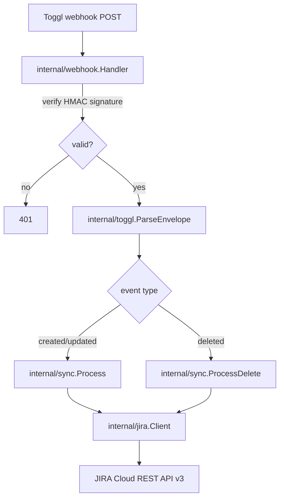

# Architecture

This monorepo holds two independent packages with unrelated architectures — nothing below this
note through **API Versioning** describes `to-jira` only. `mcp`'s architecture is summarized in
**`mcp` — Overview** near the end of this file, with full depth in `mcp/CLAUDE.md`.

## Overview / Pattern

`to-jira` is a single-process, stateless webhook service: a synchronous inbound HTTP endpoint drives a flat, layered pipeline (parse → validate → look up → write) against one outbound REST dependency (JIRA). There is no persistence layer, no queue, and no background worker — every request is handled start-to-finish within the same webhook delivery.

## High-Level Structure

## Layers

| Layer | Responsibility | Key Files or Dirs |
| ----- | -------------- | ------------------ |
| HTTP entrypoint | Signature verification, envelope parsing, event-type dispatch, HTTP status mapping | `internal/webhook/handler.go` |
| Domain parsing | Toggl wire-format types, description parsing, running-entry normalization | `internal/toggl/` |
| Orchestration | Validation rules, idempotent lookup, create/update/delete decision, dry-run branching, OTel emission | `internal/sync/` |
| API client | JIRA Cloud REST v3 calls, ADF comment marshaling, transient/permanent error classification | `internal/jira/` |
| Infrastructure | Config loading, DI wiring, logger, HTTP server lifecycle, OTel bootstrap | `internal/shared/{config,di,logger,server,telemetry}/` |

## Dependency Rules

- `internal/toggl` depends on nothing but the stdlib — it has no knowledge of JIRA or HTTP.
- `internal/jira` depends on nothing but the stdlib and its own types — it has no knowledge of Toggl or the sync orchestration.
- `internal/sync` depends on both `internal/toggl` and `internal/jira`, but talks to JIRA only through the `sync.JiraClient` interface (defined in `internal/sync`, satisfied by `*jira.Client`) — this is what lets tests fake JIRA without any live network call.
- `internal/webhook` depends on `internal/sync` and `internal/toggl`; it never imports `internal/jira` directly.
- `internal/shared/*` packages are generic infrastructure with no dependency on the domain packages (`toggl`/`jira`/`sync`/`webhook`).
- `main.go` is the only place all layers are wired together, via `internal/shared/di.BuildDependencies`.

## Request / Data Flow

1. Toggl POSTs a webhook delivery to `/webhooks/toggl`.
2. `webhook.Handler.Receive` reads the raw request body (`io.ReadAll`, capped at 1 MiB) before any JSON binding, to preserve the exact bytes Toggl signed.
3. `verifySignature` computes HMAC-SHA256 over the raw body with `TOGGL_WEBHOOK_SECRET` and compares it (`hmac.Equal`) against the `X-Webhook-Signature-256` header. A mismatch returns 401 immediately — no parsing, no downstream call.
4. `toggl.ParseEnvelope` unmarshals the raw body into `WebhookEnvelope`; a malformed envelope returns 200 (not retried).
5. Dispatch by `Metadata.RequestType`:
   - `time_entry.created` / `time_entry.updated` → unmarshal `TimeEntryPayload`, `toggl.NormalizeEntry`, then `sync.Processor.Process`.
   - `time_entry.deleted` → `sync.Processor.ProcessDelete`, which unmarshals the payload itself (its shape is unverified — see Data Model).
   - any other event type → 200, ignored.
6. `sync.Process` parses the description against `^\[([A-Z][A-Z0-9]{1,9})-(\d+)\]\s*(.*)$` (`toggl.ParseDescription`), skips still-running entries, looks up an existing worklog by TogglID marker (`jira.FindWorklogByTogglID`), then creates or updates.
7. `sync.ProcessDelete` follows the same derive-then-lookup path; a found worklog is deleted, a not-found one is a no-op, and an underivable issue key is logged as `unsupported_delete`.
8. `Result.HTTPStatus` is written straight to the gin response — 200 for validation failures/no-ops/successful writes, a non-2xx (502) for transient JIRA failures so Toggl's own retry redelivers later.

## Communication Patterns

- Inbound: single synchronous REST webhook (Toggl → `to-jira`), HMAC-authenticated, no ordering guarantee, at-least-once delivery.
- Outbound: synchronous REST calls (`to-jira` → JIRA Cloud REST API v3), HTTP Basic Auth, one call chain per webhook delivery (list-then-write, no batching).
- No internal message bus, queue, or event system — everything is direct function calls within one request's goroutine.

## Key Components

| Component | Role |
| --------- | ---- |
| `webhook.Handler` | HTTP entrypoint; signature verification and dispatch |
| `toggl.ParseEnvelope` / `NormalizeEntry` / `ParseDescription` | Wire-format parsing and validation, JIRA-agnostic |
| `sync.Processor` | Orchestrates validation, idempotent lookup, and create/update/delete against JIRA; owns dry-run and OTel |
| `sync.JiraClient` (interface) | Seam between `sync` and `jira`, enabling test doubles |
| `jira.Client` | JIRA Cloud REST v3 worklog CRUD, ADF comment marshaling, error classification |
| `di.BuildDependencies` | Staged wiring of telemetry, JIRA client, processor, and HTTP handler |
| `telemetry.Initialize` | OTel TracerProvider/MeterProvider bootstrap |

## Data Model

No persisted entities — every value is request-scoped and discarded at the end of the webhook call.

- `toggl.WebhookEnvelope` / `toggl.TimeEntryPayload`: inbound wire shapes. `TimeEntryPayload` fields are pointers because the `time_entry.deleted` payload's actual shape is unverified against a live Toggl subscription (see `to-jira/docs/NOT_IMPLEMENT.md`); a nil field distinguishes "absent" from a legitimate zero value.
- `toggl.Event`: normalized form `sync.Processor` consumes (`TogglID`, `Description`, `Duration`, `StartedAt`, `HasStopped`).
- `jira.WorklogInput` / `jira.Worklog` / `jira.ADFDocument`: outbound/inbound JIRA shapes. The relationship between a Toggl entry and a JIRA worklog is never persisted — it is re-derived every call by embedding a `[TogglID:<id>]` marker in the worklog's ADF comment and listing+filtering that issue's worklogs client-side (JIRA's REST API has no server-side comment search).

## Database Access Patterns

None — no database. See AD-001 in `.specs/STATE.md`: the TogglID → JIRA-issue relationship is always re-derived from the current event's own data plus a live `GET .../worklog` read on the one known issue, filtered client-side. This trades away automatic handling of one edge case (an already-synced entry's issue tag being edited to point at a different issue leaves the old worklog orphaned) — documented, not solved, in `to-jira/docs/NOT_IMPLEMENT.md`.

## State Management

Fully stateless between requests — no session, no cache, no in-memory store keyed by TogglID. The only state carried within a single request is passed by value/context (`logger.WithLogger`/`FromContext`).

## Error Handling Strategy

- JIRA API errors are classified at the client boundary (`jira.TransientError` for network errors/5xx/429, `jira.PermanentError` for other non-2xx) via `classifyStatus` in `internal/jira/worklog.go`.
- `sync.Processor` does not distinguish transient vs. permanent beyond mapping any JIRA-call error to `Result{HTTPStatus: 502, Outcome: OutcomeTransientError}` — both trigger Toggl's retry, since a permanently-wrong request retries with the same (still-wrong) input harmlessly (see `.specs/features/to-jira/design.md`'s Risks table).
- Validation failures (bad description format, unsupported delete payload, still-running entry) return `HTTPStatus: 200` — deliberately not retried, since retrying the same input produces the same result.
- No panics are used for control flow; `gin.Recovery()` middleware is the only panic-recovery layer, applied in `main.go`.
- Full outcome-to-status mapping: `docs/codebase/INTEGRATIONS.md` and `.specs/features/to-jira/design.md`'s Error Handling Strategy table.

## Auth Strategy

- Inbound: HMAC-SHA256 webhook signature verification, handler-local (`internal/webhook/handler.go`'s `verifySignature`) — not a gin middleware, since this is the only route and there's no other auth surface.
- Outbound: HTTP Basic Auth (email + API token) to JIRA, set per-request in `jira.Client.do`.
- No session, JWT, or user-identity concept exists — this is a single-operator, single-credential service.

## Observability

- Logging: `log/slog`, JSON handler in production / text handler otherwise (`internal/shared/logger.Initialize`). A request-scoped logger is attached to `context.Context` via `logger.WithLogger` in `webhook.Handler.Receive` and retrieved via `logger.FromContext` throughout `sync`. Structured fields consistently include `toggl_id` and `issue_key` where relevant.
- Tracing: OpenTelemetry, one span per `sync.Process`/`sync.ProcessDelete` call, tagged with `toggl.id` (`go.opentelemetry.io/otel/attribute`). OTLP HTTP exporter when `OTEL_EXPORTER_OTLP_ENDPOINT` is set, stdout/console exporter otherwise (AD-003 in `.specs/STATE.md`).
- Metrics: five `Int64Counter`s defined in `internal/shared/telemetry.Metrics` — `worklogs_created_total`, `worklogs_updated_total`, `worklogs_deleted_total`, `validation_errors_total`, `jira_api_errors_total`.
- No collector/backend (Grafana, Tempo, Loki, Prometheus) is deployed yet — telemetry is wired but has nowhere to go beyond stdout until one exists.

## API Versioning

None. The service exposes a single fixed route (`POST /webhooks/toggl`); JIRA's API is consumed at its `/rest/api/3/` path, pinned by URL, with no version negotiation logic in this codebase.

## Notable Patterns

- **Staged dependency builder** (`internal/shared/di.BuildDependencies`): explicit ordered build stages (`buildTelemetry` → `buildClients` → `buildProcessor` → `buildHandlers`), a pattern carried over from sibling reference projects (`dinherim`/`applyr`) per `.specs/features/to-jira/design.md`'s Code Reuse Analysis.
- **Interface-at-the-consumer seam for testability**: `sync.JiraClient` is defined in `internal/sync` (the consumer), not `internal/jira` (the implementer), so tests can fake it without touching the real client — the project's stated hard constraint is no live network calls in tests.
- **Idempotent upsert instead of separate create/update handling**: `time_entry.created` and `time_entry.updated` are unified into one lookup-then-create-or-update path, making duplicate delivery and out-of-order events non-issues by construction rather than by deduplication logic.
- **Swappable package-level function for failure injection**: `di.newMetrics` is a package variable defaulting to `telemetry.NewMetrics`, overridable in tests to force a build failure — mirrors the same idiom in the sibling reference projects.

## `mcp` — Overview

`mcp` (package `toggl-mcp`) is a single-process, stateless MCP server over stdio — no HTTP surface,
no queue, no background worker. `src/index.ts` loads config, builds a `TogglClient`, registers the
one tool (`list_time_entries`) on an `McpServer`, and connects a `StdioServerTransport`; the process
lives only as long as the MCP client's child-process session.

Request flow: MCP client calls `list_time_entries` → Zod input validation (`tools/schemas.ts`) →
`TogglClient.listTimeEntries` (`GET /me/time_entries`) → client-side workspace filter → if any
filtered entry has a `project_id`, `cache/project-cache.getProjects` resolves names (7-day TTL disk
cache, live `GET /me/projects` on miss/stale, stale-cache-plus-warning fallback on refetch failure)
→ `time-entries/curate.toCuratedEntry` maps to the output shape → JSON result over stdio.

Error handling mirrors `to-jira`'s intent but not its mechanism: Toggl call failures
(`TogglApiError`/`TogglNetworkError`) are logged to stderr and converted to a structured
`CallToolResult` with `isError: true` (`errors.ts`) rather than an HTTP status; anything else
propagates as an MCP protocol-level error, signaling a genuine bug rather than an expected failure.
Observability is a single stderr-only JSON line logger (`logger.ts`) — no OTel, no metrics, no
tracing (the package's scope excludes them; see `mcp/CLAUDE.md`'s Constraints).

Full architecture (Mermaid diagram, component table, data model, testing strategy, and the read-only
scope-reduction history) lives in `mcp/CLAUDE.md` — not duplicated here.
