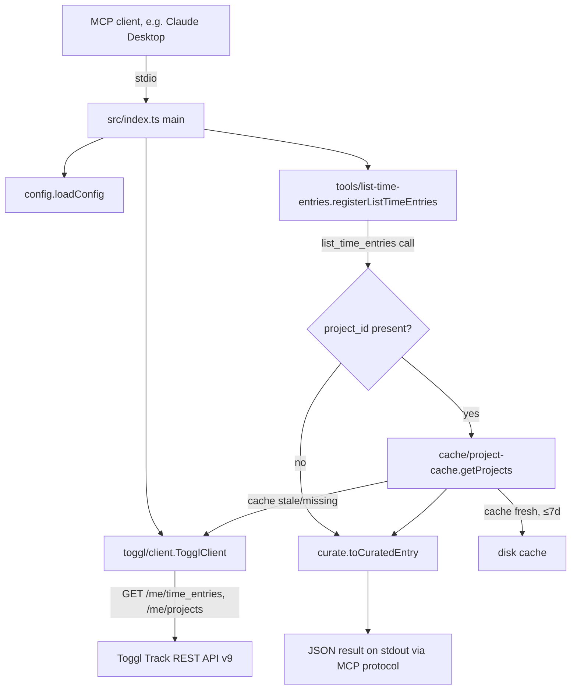

# mcp/ — Toggl Time Entries MCP Server

## Purpose

`toggl-mcp` is a stateless [Model Context Protocol](https://modelcontextprotocol.io/) server that
exposes read-only access to a single personal Toggl Track account's time entries to an MCP client
(Claude Desktop, Claude Code). It is the monorepo's second package, alongside `to-jira` — a
separate, unrelated integration surface for the same underlying Toggl data (`to-jira` reacts to
Toggl webhooks and writes to JIRA; this package is pulled by an MCP client and only reads from
Toggl). It has exactly one job: list time entries in a date range, curated down to `id`,
`description`, `start`, `stop`, and `project`. There is no create, update, or delete tool — the
server never writes to Toggl.

The package originally scaffolded six tools (`list_time_entries`, `get_time_entry`,
`create_time_entry`, `update_time_entry`, `delete_time_entry`, `refresh_projects`) plus a
ticket-code-to-project matching engine; mid-build the scope was deliberately cut back to the
single read-only `list_time_entries` tool (commit `697a9d9`), and everything else was removed.

## Architecture

Single-process, stdio-transport MCP server. `src/index.ts` is the only entrypoint: load config →
build a `TogglClient` → register the one tool on an `McpServer` → connect a `StdioServerTransport`.
There is no HTTP surface, no listener, no background process — the server lives only as long as
the MCP client's stdio child process does.

## Key Components

| Component | Role |
| --------- | ---- |
| `src/index.ts` | Process entrypoint: `.env` loading, config validation, dependency wiring, tool registration, stdio transport connect |
| `src/config.ts` | `loadConfig(env)` — validates `TOGGL_API_TOKEN`/`TOGGL_WORKSPACE_ID`/`TOGGL_CACHE_PATH`, collects every invalid/missing var into one `ConfigError` rather than failing on the first |
| `src/toggl/client.ts` | `TogglClient` — thin GET-only fetch wrapper around Toggl API v9, 30s timeout, classifies failures into `TogglApiError`/`TogglNetworkError` |
| `src/cache/project-cache.ts` | `getProjects()` — 7-day TTL disk-backed project-name cache with stale-cache-on-refetch-failure fallback |
| `src/time-entries/curate.ts` | `toCuratedEntry()` — maps a raw Toggl time entry + a project-id→name map to the curated output shape |
| `src/tools/list-time-entries.ts` | `registerListTimeEntries()` — the one MCP tool: input validation, workspace filtering, project resolution, error mapping |
| `src/tools/schemas.ts` | Shared Zod validators (`dateOrTimestamp`, `positiveId`) used by the tool's input schema |
| `src/tools/deps.ts` | `ToolDeps` — the DI contract (`client`, `cachePath`, `config`) passed into tool registration |
| `src/errors.ts` | `toErrorResult()` — maps `TogglApiError`/`TogglNetworkError` into an MCP `CallToolResult` with `isError: true` |
| `src/logger.ts` | `log()` — single stderr-only JSON line logger (stdout is reserved for MCP protocol frames) |
| `src/toggl/generated.ts` | Generated TypeScript types from Toggl's OpenAPI spec (`openapi/toggl.openapi3.json`) — not hand-edited |

## Public API

**Tool: `list_time_entries`**

- Input: `start_date` (YYYY-MM-DD or RFC3339 timestamp), `end_date` (same format, must be ≥
  `start_date` and within 366 days of it), `workspace_id` (optional positive integer, defaults to
  `TOGGL_WORKSPACE_ID`).
- Output (success): `{ entries: CuratedTimeEntry[], warnings?: [StaleCacheWarning] }`. Each
  `CuratedTimeEntry` is `{ id, description, start, stop, project }` (`stop` and `project` are
  nullable — a running entry has `stop: null`, an entry with no project has `project: null`). A
  `stale_cache` warning is attached only when project resolution fell back to a stale on-disk
  cache after a live refetch failed.
- Output (error): `{ error: { type: "toggl_api" | "network", ... } }` with `isError: true` —
  `toggl_api` errors carry `status`/`method`/`path`/`body` (and `retryAfter` when Toggl sent a
  `Retry-After` header; 404s omit `retryAfter` deliberately), `network` errors carry `message` and
  `operation`.

This tool registration is the package's entire external surface — everything else in `src/` is
internal implementation.

## Internal Design

- **Two-request-max cost model**: a call resolves in one Toggl request (`GET /me/time_entries`) if
  no filtered entry has a `project_id`, or two (adding `GET /me/projects`) on a cache miss/stale
  cache — kept deliberately low against Toggl's 30 requests/hour cap.
- **`GET /me/time_entries` is not workspace-scoped**: it returns entries across every workspace on
  the account; `list-time-entries.ts` filters to `effectiveWorkspaceId` client-side after the
  fetch.
- **Cache-write is best-effort, not fatal**: `project-cache.ts`'s `writeCache` creates the parent
  directory (`mkdir` with `mode: 0o700`), writes to a `<path>.tmp-<pid>` file, then renames into
  place; any failure is logged (stderr) and swallowed — a tool call still succeeds even if the
  cache can't persist. The cache file itself is written with `mode: 0o600`.
- **Stale-cache fallback**: if a live project refetch fails but a previously-cached file exists,
  `getProjects` returns the stale data plus a `StaleCacheWarning` (cache age + underlying error)
  instead of failing the whole tool call.
- **No retry/backoff/throttling** anywhere in the client — a deliberate scope exclusion (see
  `.specs/features/TOGGL-2-time-entries-mcp/spec.md`'s Out of Scope). A `429` from Toggl is passed
  straight back to the MCP client via `toErrorResult`, `Retry-After` header included when present.

## Data Model

- `RawTimeEntry` / `RawProject` — generated Toggl API v9 wire types (`toggl/generated.ts`), not
  hand-maintained.
- `CachedProject` (`{ id, name, active, workspaceId }`) — the on-disk cache's per-project shape,
  defensively defaulted from a raw project (`id`/`workspaceId` → `0`, `name` → `""`, `active` →
  `false` when absent).
- `CuratedTimeEntry` (`{ id, description, start, stop, project }`) — the tool's output shape; the
  only representation of a time entry an MCP client ever sees.

## Dependencies (External)

| Library | Version | Purpose |
| ------- | ------- | ------- |
| `@modelcontextprotocol/sdk` | `^1.30.0` | `McpServer`/`StdioServerTransport` — the MCP protocol implementation |
| `dotenv` | `^17.4.2` | Loads `mcp/.env` at startup so `TOGGL_API_TOKEN`/`TOGGL_WORKSPACE_ID` are available via `process.env` before `loadConfig` runs |
| `zod` | `^4.4.3` | Input schema validation for the tool's arguments (`dateOrTimestamp`, `positiveId`) |
| `typescript` (dev) | `^5.9.3` | Compiles `src/**/*.ts` to `dist/` (`NodeNext` module resolution, ES2022 target, `strict: true`) |
| `openapi-typescript` / `swagger2openapi` (dev) | `^7.13.0` / `^7.0.8` | Regenerate `src/toggl/generated.ts` from `openapi/toggl.swagger2.json` via `npm run generate:openapi` |
| `@types/node` (dev) | `^26.3.0` | Node stdlib types |

No HTTP client dependency — the built-in `fetch` (Node ≥ 18) is used directly.

## Integration Points

- **Toggl Track REST API v9** (outbound, read-only): `GET /me/time_entries`, `GET /me/projects`.
  HTTP Basic Auth (API token as username, literal string `api_token` as password). 30s
  `AbortSignal.timeout` per request. See `docs/codebase/INTEGRATIONS.md`.
- **MCP client** (inbound, stdio): whatever process spawns `dist/index.js` as a child and speaks
  MCP over its stdin/stdout — Claude Desktop or `claude mcp add` per `mcp/README.md`.
- **Local disk cache**: `~/.cache/toggl-mcp/projects.json` by default (`TOGGL_CACHE_PATH`
  overridable) — not shared with `to-jira`; entirely private to this package.
- No relationship to `to-jira` in code — they are independent packages under the same monorepo
  root, both consuming Toggl data through different protocols for different purposes.

## Error Handling

- Config errors (`ConfigError`) at startup: every invalid/missing variable is named in one message,
  logged via `log("error", ...)` to stderr, process exits with code 1 before any tool registers —
  guaranteeing zero bytes ever reach stdout on a bad config.
- Toggl call failures inside the tool handler (`TogglApiError`/`TogglNetworkError`) are logged to
  stderr and converted to a structured `CallToolResult` with `isError: true` via `toErrorResult` —
  never thrown back through the MCP SDK.
- Any error not one of those two types propagates unhandled (rethrown), surfacing as an MCP
  protocol-level error rather than a tool result — this is intentional: it signals a genuine bug
  rather than an expected Toggl-call failure.
- `main().catch(...)` in `index.ts` is the last-resort handler for anything thrown outside the
  per-call try/catch (e.g. `server.connect` itself failing) — logs and exits 1.

## Constraints

- **Single account, single client at a time** — no multi-tenant or concurrent-client design; the
  server assumes one stdio child process per MCP client session.
- **Toggl's 30 requests/hour cap** is the binding external constraint; the two-request-max design
  and the 7-day project cache exist specifically to stay well under it.
- **`stdout` is reserved exclusively for MCP protocol frames** — `src/logger.ts`'s `log()` writes
  to `console.error` (stderr) only, by explicit requirement (`TEM-24 AC4`); nothing else in the
  codebase should ever `console.log`.
- **`src/toggl/generated.ts` is generated, not hand-edited** — regenerate via
  `npm run generate:openapi` when `openapi/toggl.swagger2.json` changes.

## Conventions

Mirrors `docs/codebase/CONVENTIONS.md` where a TypeScript equivalent of a Go pattern exists (e.g.
`to-jira`'s "collect every invalid field into one joined error" pattern is deliberately mirrored by
`config.ts`'s `ConfigError`, per the `TEM-01` comment in the source). TypeScript-specific
conventions observed in this package:

- **Files:** lowercase, hyphenated for multi-word (`list-time-entries.ts`, `project-cache.ts`).
  Test files use a `.test.ts` suffix co-located with the source (`config.ts` ↔ `config.test.ts`).
- **Functions:** `camelCase` (`loadConfig`, `toCuratedEntry`, `getProjects`); classes
  `PascalCase` (`TogglClient`, `TogglApiError`, `ConfigError`).
- **Errors:** dedicated `Error` subclasses per failure kind (`TogglApiError`, `TogglNetworkError`,
  `ConfigError`), each setting `this.name` to its own class name; never bare `throw new Error(...)`
  for an expected/typed failure.
- **Strict TypeScript**: `strict: true` in `tsconfig.json`; `declare readonly retryAfter?: string`
  on `TogglApiError` is a deliberate pattern to keep an optional field genuinely absent (not
  present-but-`undefined`) when Toggl sends no `Retry-After` header — documented inline because it
  is non-obvious.
- **Module system:** ESM throughout (`"type": "module"` in `package.json`, `NodeNext` resolution),
  relative imports use explicit `.js` extensions even though the source is `.ts` (TypeScript/NodeNext
  requirement).

## Testing Strategy

- **Runner:** Node's built-in `node --test` (no Jest/Vitest/Mocha) against compiled output —
  `npm test` runs `tsc` then `node --test 'dist/**/*.test.js'`. `npm run test:unit` /
  `npm run test:integration` split the fast in-process tests (`config`, `tools/**`) from the one
  slower real-subprocess file (`index.test.ts`, which spawns `node dist/index.js`).
  Full suite: 83 tests passing as of the last fix-review pass.
- **No live network calls in any test** — `src/tools/test-harness.ts` provides a shared
  `startFakeToggl` (a real local `http.Server` standing in for the Toggl API),
  `connectToolClient` (an in-memory MCP client/server pair via `InMemoryTransport`, no stdio/
  subprocess), and `makeTmpCachePath`/`writeProjectCache` helpers for cache-layer tests.
- **Layer coverage:** `config.test.ts` (env validation, all-error-collection), `client.test.ts`
  (HTTP boundary via `startFakeToggl` equivalent, status/timeout/body-parsing branches),
  `project-cache.test.ts` (TTL freshness/staleness, stale-fallback, write-failure degrade path),
  `curate.test.ts` (pure-function mapping, defensive defaults), `list-time-entries.test.ts`
  (end-to-end tool call via `connectToolClient`, both Toggl-call and project-fetch failure paths),
  `errors.test.ts` / `schemas.test.ts` / `logger.test.ts` (pure-function unit tests),
  `index.test.ts` (real subprocess spawn: bad-config exit codes/stderr content, and one
  happy-path MCP handshake).
- **Known gap (deliberately left open):** `index.test.ts`'s happy-path subprocess test does not
  verify the spawned `dist/index.js` process actually exits after `client.close()` — flagged in
  fix-review (finding `I5`) with no documented MCP SDK API to assert it cleanly, left unresolved
  pending a deliberate follow-up decision rather than a speculative fix.
